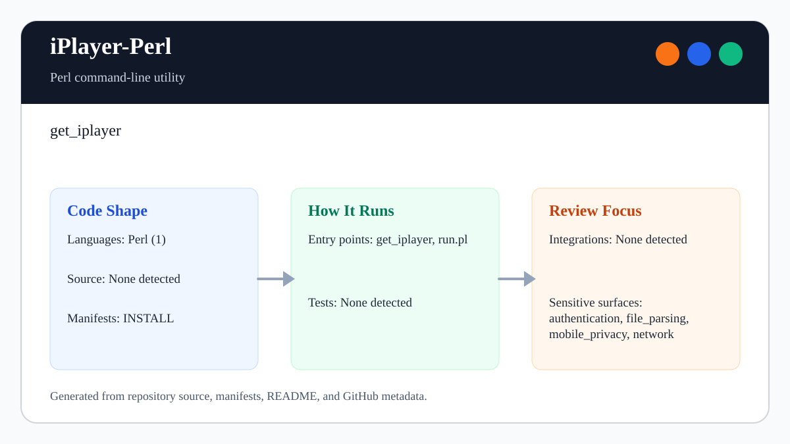

# iPlayer-Perl

<!-- README-OVERVIEW-IMAGE -->


## Overview

`garethpaul/iPlayer-Perl` is a Perl command-line utility. get_iplayer

This README is based on the checked-in source, manifests, scripts, and repository metadata on the `master` branch. The project language mix found during review was: Perl (1).

## Repository Contents

- `CHANGES.md` - recent maintenance changes
- `Makefile` - local static verification entry point
- `README.md` - project overview and local usage notes
- `README`
- `get_iplayer` - main command-line program
- `INSTALL` - project installation notes
- `run.pl` - Perl script or command wrapper
- `scripts/check-baseline.py` - static Perl/content-access baseline checks
- `SECURITY.md` - security reporting and disclosure guidance
- `VISION.md` - project direction and maintenance guardrails

Additional scan context:

- Source directories: no top-level source directories detected
- Dependency and build manifests: INSTALL
- Entry points or build surfaces: `make lint`, `make test`, `make build`, `make check`, get_iplayer, run.pl
- Test-looking files: no obvious test files detected

## Getting Started

### Prerequisites

- Git
- Perl
- Python 3 for static verification with `make lint`, `make test`, `make build`, and `make check`

### Setup

```bash
git clone https://github.com/garethpaul/iPlayer-Perl.git
cd iPlayer-Perl
make lint
make test
make build
make check
```

The setup commands above are derived from repository files. Legacy mobile, Python, or JavaScript samples may require older SDKs or package versions than a modern workstation uses by default.

## Running or Using the Project

- Run `./get_iplayer --help` to inspect command-line options, then use the options relevant to the BBC programme or radio workflow you are testing.
- Use `./run.pl --help` when exercising the wrapper. It forwards arguments directly to `get_iplayer` without invoking a shell and builds `PERL5LIB` with Perl's configured path separator. The wrapper prepends existing local library paths for the `mouse`, `mousex-getopt`, and `mousex-nativetraits` submodules before preserving any existing `PERL5LIB` value, while avoiding duplicate local library paths already present in the environment, including trailing slash and canonical path variants.
- Submodule URLs use HTTPS mirrors so dependency checkout metadata does not rely
  on unauthenticated `git://` transport.
- This tool can download or stream media, use cookies or credentials, and invoke external players/transcoders depending on user-supplied options. Keep content access explicit and user-controlled.

## Testing and Verification

- `make lint`, `make test`, `make build`, and `make check` run `scripts/check-baseline.py`, which validates Perl syntax with `perl -c`, verifies help output, parses the compressed man page and SVG overview, checks safe wrapper argument forwarding, existing local library paths, local submodule library paths, duplicate local library paths including trailing slash and canonical path variants, HTTPS submodule URLs, and `PERL5LIB` path separator handling, and enforces documentation guardrails.
- The `lint`, `test`, and `build` targets intentionally alias the static
  baseline so the standard local gate commands stay available while preserving
  the same Perl syntax and wrapper checks as `make check`.
- `perl -c run.pl`
- `perl -c get_iplayer`

When the required SDK or runtime is unavailable, use static checks and source review first, then verify on a machine that has the matching platform toolchain.

## Configuration and Secrets

- No required secret or credential file was identified in the repository scan. If you add integrations later, keep secrets out of git.
- Do not commit cookies, credentials, private keys, proxy secrets, generated download history, local preference files, downloaded media, or generated subtitles.

## Security and Privacy Notes

- Review changes touching authentication or token handling; examples from the scan include get_iplayer.
- Keep credential and cookie usage visible, documented, and tied to explicit user options. Do not add hidden collection, telemetry, or background content access.
- Review changes touching network requests, sockets, or service endpoints; examples from the scan include get_iplayer.
- Wrapper changes must preserve argument boundaries and avoid shell command construction from user input.
- Review changes touching file, media, JSON, XML, CSV, OCR, or data parsing; examples from the scan include get_iplayer.
- Downloaded media and generated artifacts should remain local and ignored unless explicitly documented for a fixture or test.

## Maintenance Notes

- Run `make lint`, `make test`, `make build`, and `make check` before pushing changes to `run.pl`, `get_iplayer`, docs, ignore rules, or generated help/manpage handling.
- See `SECURITY.md` for vulnerability reporting and safe research guidance.
- See `VISION.md` for project direction and contribution guardrails.
- See `docs/plans/2026-06-09-make-gate-aliases.md` for the local gate alias guardrail.

## Contributing

Keep changes small and tied to the project that is already present in this repository. For code changes, document the toolchain used, avoid committing generated dependency directories or local configuration, and update this README when setup or verification steps change.
